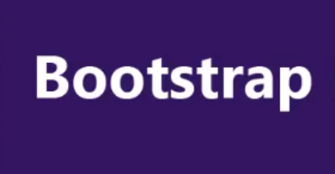
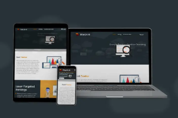
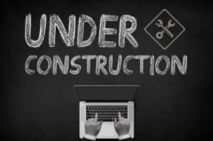

# portfolio
Final project repository
## List of resources
1. ### Home page
I used this image from istockphoto as a background of the text on the home page

I displayed these images from istockphoto on the home page to show what language
that I can use to develop websites

2. ### Services page
I used this images from istockphoto to show services that I can provide to customers/clients

### External links resources used
I used this link in the head section of the html code for properly utilizing the bootstrap framework's styles and functionality in my web portfolio
'<link href="https://cdn.jsdelivr.net/npm/bootstrap@5.3.1/dist/css/bootstrap.min.css" rel="stylesheet" integrity="sha384-4bw+/aepP/YC94hEpVNVgiZdgIC5+VKNBQNGCHeKRQN+PtmoHDEXuppvnDJzQIu9" crossorigin="anonymous">'

I used this library link to easily apply animations to the elements in my portfolio by adding css classes to them.
'<link rel="stylesheet" href="https://cdnjs.cloudflare.com/ajax/libs/animate.css/4.1.1/animate.min.css"/>'

''