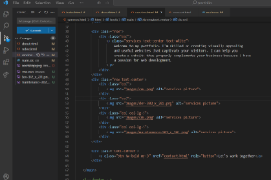

# portfolio
Final project repository
## List of resources
1. ### Home page
I used this image from istockphoto as a background of the text on the home page

I displayed these images from istockphoto on the home page to show what language
that I can use to develop websites

2. ### Services page
I used this images from istockphoto to show services that I can provide to customers/clients

### External links resources used
I used a link in the head section of my html codes for properly utilizing the bootstrap framework's styles and functionality in my web portfolio. (the link couldn't be displayed here in the readme file but it's in the head section of every page that I used).

I used the animation library link to easily apply animations to the elements in my portfolio by adding css classes to them. (the link couldn't be display in th readme file, its in head section of all my html pages).

I used this script in the head section to be able display fontawesome icons in the body of my portfolio pages
